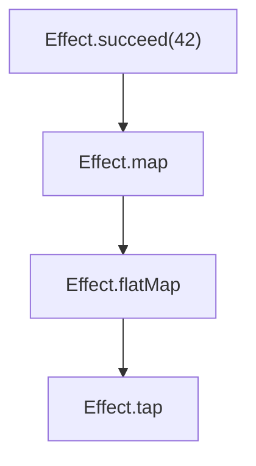
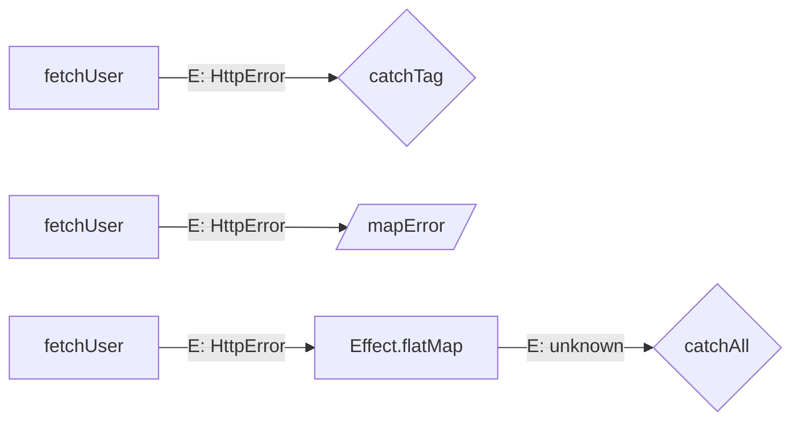
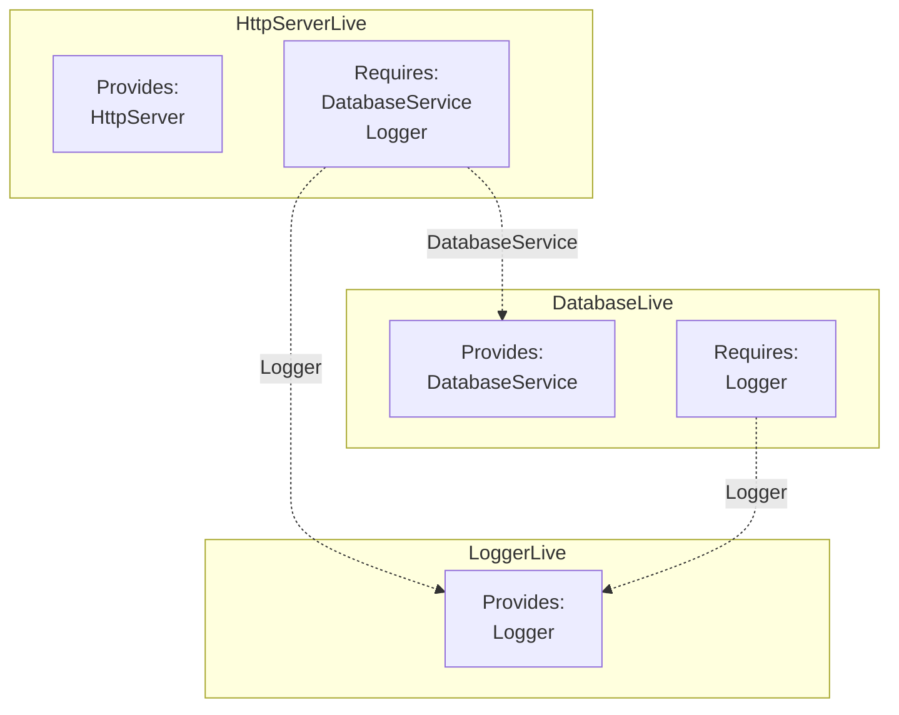

# Effect-TS Execution Diagram Action

A GitHub Action that analyzes Effect-TS code changes in pull requests and posts Mermaid diagrams as PR comments.

## What it does

When a PR is opened or updated, this action:

1. Identifies changed `.ts`/`.tsx` files
2. Analyzes them for Effect-TS patterns
3. Generates Mermaid diagrams and posts them as a PR comment

Three diagram types are generated as Mermaid flowcharts:

- **Execution Flow** — Visualizes `pipe` chains, `Effect.gen` yield steps, and `flatMap` sequences as flowcharts
- **Layer Dependencies** — Shows which layers provide and require which services, with edges linking requirements to providers
- **Error Channels** — Tracks how the error type parameter changes through `catchAll`, `catchTag`, `mapError`, and other error-handling combinators

A fourth diagram type is available for local development:

- **Sequence Diagrams (ZenUML)** — Renders Effect-TS gen functions and pipe chains as sequence diagrams using the ZenUML notation inside Mermaid blocks. Service method calls, `Effect.all` concurrency, `Effect.forEach` loops, `Effect.fork`, cross-file sub-program expansion, and `try/catch` error handling are all mapped to ZenUML constructs. See `docs/zenuml-reference.md` for the full mapping.

Flowchart diagrams are rendered natively by GitHub's Mermaid support inside collapsible `<details>` sections. ZenUML sequence diagrams work with mermaid-cli and VS Code extensions but may not render on GitHub (unconfirmed).

## Example output

The diagrams below were generated by running the project's own analyzers against the test fixtures (`npx tsx scripts/generate-examples.ts`).

### Execution Flow

From an `Effect.gen` generator (`test/fixtures/gen-flow.ts`):


From a `pipe` chain (`test/fixtures/simple-pipe.ts`):



### Error Channels

From `test/fixtures/error-handling.ts` — shows `catchTag`, `mapError`, and `catchAll` chains:



### Layer Dependencies

From `test/fixtures/layer-composition.ts`:



## Usage

Add this workflow to your Effect-TS project:

```yaml
# .github/workflows/effect-diagrams.yml
name: Effect Diagrams

on: pull_request

jobs:
  diagrams:
    runs-on: ubuntu-latest
    permissions:
      pull-requests: write
    steps:
      - uses: actions/checkout@v4
      - uses: actions/setup-node@v4
        with:
          node-version: 20
      - run: npm ci
      - uses: <owner>/effect-execution-diagram-action@main
        with:
          github-token: ${{ secrets.GITHUB_TOKEN }}
```

## Inputs

| Input | Required | Default | Description |
|---|---|---|---|
| `github-token` | yes | `${{ github.token }}` | Token for posting PR comments |
| `tsconfig-path` | no | `tsconfig.json` | Path to the project's tsconfig |
| `include-flow-diagram` | no | `true` | Generate execution flow diagram |
| `include-layer-diagram` | no | `true` | Generate layer dependency diagram |
| `include-error-diagram` | no | `true` | Generate error channel diagram |

## How it works

The action uses two analysis strategies:

- **`@effect/language-service` CLI** — The `overview` and `layerinfo` commands extract service, layer, and error declarations from Effect code. Text output is parsed into structured data for the layer dependency diagram.
- **TypeScript Compiler API** — The action creates a `ts.Program` from your project's tsconfig and walks the AST of changed files to identify `pipe` chains, `Effect.gen` generators, `flatMap` calls, and error-handling combinators. The type checker extracts `Effect<A, E, R>` type parameters to track error channel propagation.

Diagrams are capped at 100 nodes each to stay within GitHub's Mermaid rendering limits. If truncated, a note is included.

## Local development

### Setup

```bash
npm install
npm test          # run vitest
npm run lint      # type-check
npm run build     # compile + bundle with ncc
```

The bundled output in `dist/index.js` is committed to the repo (required for JavaScript GitHub Actions).

### Dev CLI

The project includes a local dev CLI (`src/dev.ts`) for running the analysis pipeline without GitHub. This is the primary way to iterate on diagram output.

```bash
npx tsx src/dev.ts [options] [files...]
```

**Options:**

| Flag | Description |
|---|---|
| `--diff [ref]` | Analyze files changed vs a git ref (default: uncommitted changes) |
| `--all` | Analyze all `.ts` files known to the tsconfig |
| `--tsconfig PATH` | Path to `tsconfig.json` (default: `tsconfig.json`) |
| `--json` | Output raw analysis JSON instead of diagrams |
| `--no-flow` | Skip execution flow diagrams |
| `--no-error` | Skip error channel diagrams |
| `--sequence` | Include ZenUML sequence diagrams |
| `--max-depth N` | Max depth for cross-file ref expansion (default: 3, 0 disables) |

**Examples:**

```bash
# Analyze test fixtures — flowcharts + error diagrams (default)
npx tsx src/dev.ts --all --tsconfig test/fixtures/tsconfig.json

# Sequence diagrams only
npx tsx src/dev.ts --all --no-flow --no-error --sequence --tsconfig test/fixtures/tsconfig.json

# All diagram types together
npx tsx src/dev.ts --all --sequence --tsconfig test/fixtures/tsconfig.json

# Analyze specific files in your own project
npx tsx src/dev.ts src/services/database.ts src/handlers/api.ts

# Analyze your uncommitted changes
npx tsx src/dev.ts --diff --sequence

# Dump raw analysis JSON for debugging
npx tsx src/dev.ts --all --json --tsconfig test/fixtures/tsconfig.json
```

### Rendering ZenUML diagrams locally

The dev CLI outputs Mermaid code blocks. To render ZenUML sequence diagrams as images:

```bash
# Save output to a file
npx tsx src/dev.ts --all --no-flow --no-error --sequence \
  --tsconfig test/fixtures/tsconfig.json > output.md

# Render a .mmd file with mermaid-cli
npx @mermaid-js/mermaid-cli -i samples/gen-function.mmd -o samples/gen-function.svg
```

Validated ZenUML samples are in `samples/` — each `.mmd` file can be rendered independently with mermaid-cli. See `docs/zenuml-reference.md` for syntax details and the mapping between Effect-TS constructs and ZenUML.

## License

ISC
